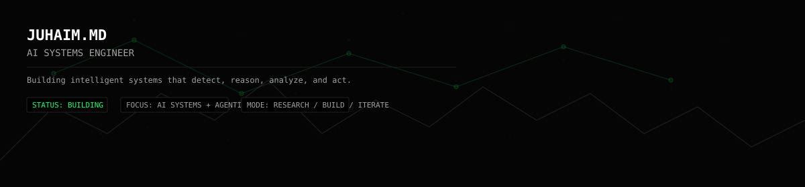

# JUHAIM.MD
AI SYSTEMS ENGINEER

<!--
  NOTE:
  - Save this file as README.md in a repository named exactly: `Juhamim`
  - Place banner.svg (file below) alongside this README.md so the header image renders.
  - Replace placeholders marked with:  <<REPLACE: ... >>  or <!-- CONFIRM: ... -->
-->

<!-- HERO / SYSTEM HEADER -->
<p align="center" style="margin-top:0">
  
</p>

<pre style="background:#050505;color:#FFFFFF;padding:18px;border:1px solid #222222;border-radius:6px;font-family:monospace;line-height:1.3">
JUHAIM.MD
AI SYSTEMS ENGINEER

Building intelligent systems that detect, reason, analyze, and act.

STATUS: BUILDING
FOCUS: AI SYSTEMS + AGENTIC AI
MODE: RESEARCH / BUILD / ITERATE
</pre>

---

## SYSTEM_PROFILE

- ROLE
  - Engineering Student

- DOMAIN
  - Artificial Intelligence / Machine Learning

- SPECIALIZATION
  - Agentic AI · Intelligent Systems

- CURRENT_OBJECTIVE
  - Build practical AI systems capable of reasoning, analyzing data, detecting patterns, and taking intelligent actions.

---

## CURRENT SYSTEMS — Featured Project: SENTINEL MESH

### SENTINEL_MESH — AI RISK INTELLIGENCE
Unified merchant loss prevention system combining transaction-level risk analysis with relationship-based intelligence.

One-line mission:
> See the loss pattern before the loss becomes visible.

Modules
- [01] Transaction Risk Detection
- [02] Chargeback Intelligence
- [03] Temporal Graph Analysis
- [04] Coordinated Attack Detection
- [05] AI Risk Fusion
- [06] Intelligent Prevention Actions

Tech stack (core)
- Python · Machine Learning · Graph Intelligence · LLMs · FastAPI · React · PostgreSQL

Repository
- SentinelMesh — https://github.com/Juhamim/SentinelMesh

Architecture (mermaid)
```mermaid
flowchart TD
  TS[TRANSACTION SIGNALS] --> IR[INDIVIDUAL RISK ENGINE]
  IR --> TG[TEMPORAL RELATIONSHIP GRAPH]
  TG --> CD[COORDINATED LOSS DETECTION]
  CD --> RF[AI RISK FUSION]
  RF --> PA[PREVENTION ACTION]
