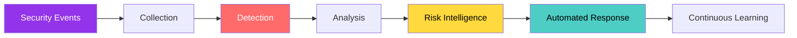
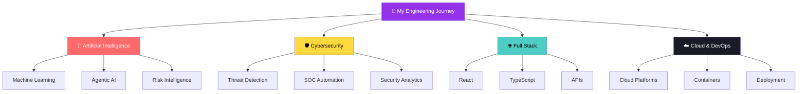
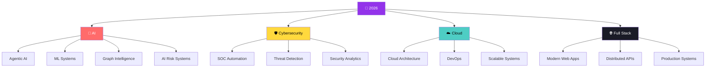

<div align="center">


# 👨‍💻 Juhaim

### **AI × Cybersecurity × Intelligent Systems**

**Engineering Student & Technology Enthusiast**
Python · TypeScript · JavaScript · AI/ML · Cybersecurity · Cloud · Full-Stack

<a href="https://github.com/Juhamim">
  
</a>

<br>

<a href="https://github.com/Juhamim">

</a>

<a href="https://github.com/Juhamim?tab=repositories">

</a>


<br><br>


</div>

---

<div align="center">

### 🧭 Quick Navigation

[📊 Stats](#-github-stats) ·
[👋 About](#-about-me) ·
[🛠️ Stack](#️-technology-stack) ·
[🚀 Projects](#-featured-projects) ·
[🛡️ Security](#️-security--soc-projects) ·
[🤖 AI](#-ai--intelligent-systems) ·
[🗺️ Roadmap](#️-2026-roadmap) ·
[🎯 Approach](#-engineering-approach)

</div>

---

<div align="center">


</div>

## 📊 GitHub Stats

<div align="center">


<br><br>


<br><br>


</div>

---

<div align="center">


</div>

## 👋 About Me

```typescript
const juhaim = {
    role: "Engineering Student",
    identity: "Technology Enthusiast",

    focus: [
        "Artificial Intelligence",
        "Cybersecurity",
        "Intelligent Automation",
        "Cloud & DevOps",
        "Full-Stack Engineering"
    ],

    currentlyBuilding: [
        "AI-powered security systems",
        "Risk intelligence platforms",
        "SOC automation experiments",
        "Modern full-stack applications"
    ],

    interests: [
        "Machine Learning",
        "Agentic AI",
        "Threat Detection",
        "Graph Intelligence",
        "Security Automation",
        "Cloud Architecture"
    ],

    philosophy:
        "Learn → Build → Test → Break → Improve → Repeat"
};
```

### 🧠 My Mission

I'm exploring how **Artificial Intelligence can make cybersecurity systems more intelligent, adaptive, automated, and capable of understanding complex patterns.**

My main direction:

```text
AI
 ↓
Machine Learning
 ↓
Pattern & Anomaly Detection
 ↓
Risk Intelligence
 ↓
Automated Decision Making
 ↓
Intelligent Cyber Defense
```

> **I don't want to only use AI — I want to understand how intelligent systems are engineered.**

---

<div align="center">


</div>

## 🔬 Research Vector

| #    | Area                        | What I'm Exploring                              |
| ---- | --------------------------- | ----------------------------------------------- |
| `01` | 🤖 **AI for Cybersecurity** | Using AI for threat detection and risk analysis |
| `02` | 🛡️ **Threat Detection**    | Identifying suspicious behaviour and anomalies  |
| `03` | 🧠 **Agentic AI**           | Reasoning, planning and automated workflows     |
| `04` | ⚡ **Security Automation**   | Automating repetitive SOC workflows             |
| `05` | 🕸️ **Graph Intelligence**  | Detecting connected and coordinated threats     |
| `06` | 💳 **Risk Intelligence**    | Transaction and merchant risk analysis          |
| `07` | 🔎 **Intelligent Systems**  | Systems that detect → reason → act              |

---

<div align="center">


</div>

# 🛡️ Sentinel Mesh

### **AI Risk Intelligence for Merchant Loss Prevention**

> **See the loss pattern before the loss becomes visible.**

Sentinel Mesh is my flagship project for exploring how **individual transaction risk + relationship intelligence** can work together to detect coordinated loss patterns.

### Core Modules

```text
TRANSACTION SIGNALS
        │
        ▼
┌───────────────────────┐
│ INDIVIDUAL RISK ENGINE│
└───────────┬───────────┘
            │
            ▼
┌────────────────────────────┐
│ TEMPORAL RELATIONSHIP GRAPH│
└────────────┬───────────────┘
             │
             ▼
┌────────────────────────┐
│ COORDINATED LOSS ENGINE │
└────────────┬───────────┘
             │
             ▼
┌──────────────────────┐
│ AI RISK FUSION       │
└────────────┬─────────┘
             │
             ▼
┌──────────────────────┐
│ PREVENTION ACTION    │
└──────────────────────┘
```

### Intelligence Layers

* 🔍 Transaction Risk Detection
* 💳 Chargeback Intelligence
* 🕸️ Temporal Graph Analysis
* 🚨 Coordinated Attack Detection
* 🧠 AI Risk Fusion
* ⚡ Intelligent Prevention

### Core Technology

`Python` · `Machine Learning` · `Graph Intelligence` · `LLMs` · `FastAPI` · `React` · `PostgreSQL`

### 🔗 Project

**[→ Explore Sentinel Mesh](https://github.com/Juhamim/SentinelMesh)**

---

<div align="center">


</div>

# 🛠️ Technology Stack

<div align="center">

<a href="https://skillicons.dev">


</a>

</div>

### 💻 Languages


### 🌐 Web & Backend


### 🤖 AI / ML


### ☁️ Cloud & DevOps


### 🗄️ Databases


---

<div align="center">


</div>

# 🚀 Featured Projects

### 🛡️ AI & Cybersecurity

| Project                   | Description                                                                   | Stack                | Status       |
| ------------------------- | ----------------------------------------------------------------------------- | -------------------- | ------------ |
| 🕸️ **Sentinel Mesh**     | AI-powered merchant risk intelligence and coordinated loss detection          | Python · ML · Graphs | 🚧 Building  |
| 🧠 **SOCLab AI**          | Offline SOC learning, simulation, detection and incident-response environment | JavaScript           | 🚧 Active    |
| ⚡ **ThreatThunder**       | Security/threat intelligence experimentation                                  | TypeScript           | 🚧 Active    |
| 🤖 **AI ThreatThunder**   | AI-assisted threat intelligence experimentation                               | AI · TypeScript      | 🚧 Active    |
| 🔐 **SOC Automation Bot** | Security operations automation experiment                                     | TypeScript           | 🧪 Prototype |

### 🌐 Web & Full-Stack

| Project               | Description                            | Stack      | Status          |
| --------------------- | -------------------------------------- | ---------- | --------------- |
| 🍛 **Kerala Kitchen** | Modern food/e-commerce web application | TypeScript | 🚧 Active       |
| ☁️ **Cloud Printing** | Cloud-connected printing system        | JavaScript | 🚧 Active       |
| 🔎 **RepoScan**       | Repository/code inspection tooling     | Python     | 🚧 Active       |
| 🔍 **Clint Search**   | Modern search-oriented web project     | TypeScript | 🚧 Active       |
| 🎨 **Astra**          | Modern web interface/project           | CSS        | 🧪 Experimental |

### 🧠 Experimental Systems

| Project                 | Description                                 | Stack      |
| ----------------------- | ------------------------------------------- | ---------- |
| 🧠 **SIR**              | Signal/inference research experiment        | Python     |
| 🧩 **HerMindMate**      | AI-oriented experimental application series | TypeScript |
| 🧩 **HerMindMate Game** | Interactive experimental application        | TypeScript |

> **Note:** Projects are intentionally presented according to their current public repository state rather than overstating production readiness.

---

<div align="center">


</div>

# 🛡️ Security & SOC Projects

My cybersecurity work focuses on **learning, experimentation, defensive thinking, detection and automation**.



### Current Security Direction

* 🔎 Threat Detection
* 🛡️ SOC Operations
* 🤖 Security Automation
* 🧠 AI-assisted Analysis
* 📊 Anomaly Detection
* 🕸️ Graph-based Security Intelligence
* ⚡ Automated Incident Workflows

---

<div align="center">


</div>

# 💡 What I'm Building



---

# 🧭 Engineering Approach

```text
                 ┌─────────────┐
                 │    IDEA     │
                 └──────┬──────┘
                        ↓
                 ┌─────────────┐
                 │   RESEARCH  │
                 └──────┬──────┘
                        ↓
                 ┌─────────────┐
                 │ ARCHITECTURE│
                 └──────┬──────┘
                        ↓
                 ┌─────────────┐
                 │    BUILD    │
                 └──────┬──────┘
                        ↓
                 ┌─────────────┐
                 │    TEST     │
                 └──────┬──────┘
                        ↓
                 ┌─────────────┐
                 │   DEPLOY    │
                 └──────┬──────┘
                        ↓
                 ┌─────────────┐
                 │   ITERATE   │
                 └─────────────┘
```

### My Principles

> **Curiosity → Experimentation → Engineering → Iteration**

I believe the fastest way to understand a technology is to **build something real with it**.

---

<div align="center">


</div>

# 🗺️ 2026 Roadmap



### 🎯 Current Priorities

* [x] Build real-world full-stack projects
* [x] Explore AI-powered security systems
* [x] Build Sentinel Mesh
* [x] Experiment with SOC automation
* [ ] Deepen Machine Learning
* [ ] Build advanced agentic systems
* [ ] Expand cloud/DevOps expertise
* [ ] Contribute more to open source

---

<details>
<summary><h2 style="display:inline;">📚 Currently Learning</h2></summary>

<br>

```text
AI / ML
├── Machine Learning
├── Deep Learning
├── LLMs
├── Agentic AI
└── Graph Intelligence

Cybersecurity
├── Threat Detection
├── SOC Operations
├── Security Automation
├── Risk Analysis
└── Defensive Security

Engineering
├── Cloud Architecture
├── DevOps
├── Distributed Systems
├── APIs
└── Full-Stack Development
```

</details>

---

<details>
<summary><h2 style="display:inline;">🌱 Beyond Coding</h2></summary>

<br>

I enjoy exploring ideas across technology and using different domains to improve the way I think about engineering problems.

**Curiosity areas:**

`AI` · `Cybersecurity` · `Science` · `Systems` · `Technology` · `Automation`

</details>

---

<div align="center">

## 🎯 Profile Philosophy

### **TECH CURIOSITY + AI AMBITION + SECURITY MINDSET + REAL-WORLD BUILDING**

<br>

> *"Learn deeply. Build boldly. Iterate relentlessly."*

<br>

### 🤝 Let's Build Something Interesting

<a href="https://github.com/Juhamim">

</a>

<br><br>


<br>

⭐ **Explore the repositories. Build something. Break something. Learn something.**

</div>
