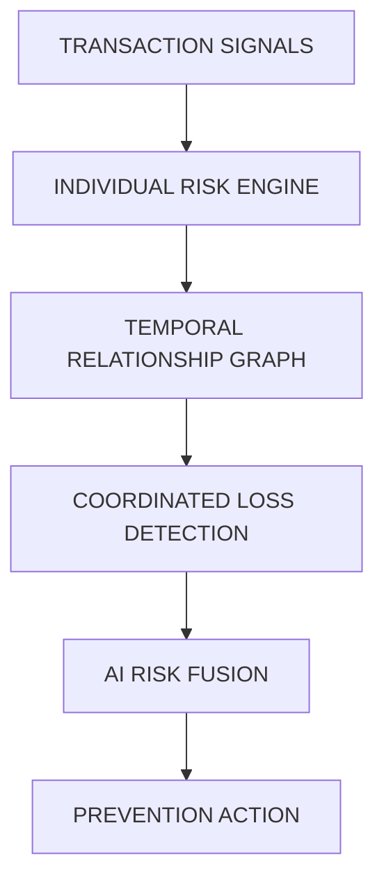

# JUHAIM.MD
TECH ENTHUSIAST × AI × CYBERSECURITY

<!--
  Profile README for GitHub user `Juhamim`.
  - Place banner.svg next to this README to render the monochrome header.
  - Replace placeholders marked with:  <<REPLACE: ... >>  or <!-- CONFIRM: ... -->
-->

<!-- HERO / SYSTEM HEADER -->

  

<pre style="background:#050505;color:#FFFFFF;padding:18px;border:1px solid #222222;border-radius:6px;font-family:monospace;line-height:1.3">
JUHAIM.MD
TECH ENTHUSIAST × AI × CYBERSECURITY

Exploring the intersection of AI and cybersecurity.

STATUS: EXPLORING
FOCUS: AI × CYBERSECURITY × INTELLIGENT AUTOMATION
MODE: RESEARCH / BUILD / ITERATE
</pre>

---

## CORE IDENTITY

I am a technology enthusiast and cybersecurity student with a strong interest in exploring how Artificial Intelligence can enhance cybersecurity.

I enjoy experimenting with emerging technologies and building intelligent systems that combine AI, automation, data, and security.

My goal is to explore the intersection of:

ARTIFICIAL INTELLIGENCE
        ×
CYBERSECURITY
        ×
INTELLIGENT AUTOMATION

I am particularly interested in how AI can help security systems detect threats, analyze complex patterns, understand risks, automate repetitive security workflows, and support faster decision-making.

---

## SYSTEM_PROFILE

- ROLE
  - Engineering Student

- IDENTITY
  - Technology Enthusiast

- SECURITY_DOMAIN
  - Cybersecurity (student / explorer)

- AI_DOMAIN
  - Artificial Intelligence / Machine Learning / Agentic AI

- CURRENT_EXPLORATION
  - AI × Cybersecurity

- MISSION
  - Explore and build intelligent systems that can analyze, detect, reason about, and respond to complex security challenges.

---

## RESEARCH_VECTOR

CURRENT_INTERESTS

[01] AI-POWERED CYBERSECURITY
Using Artificial Intelligence to enhance threat detection, risk analysis, and security operations.

[02] INTELLIGENT THREAT DETECTION
Exploring machine learning and data-driven approaches for identifying suspicious patterns and anomalies.

[03] AGENTIC AI
Building AI systems capable of reasoning, planning, and executing intelligent workflows.

[04] SECURITY AUTOMATION
Exploring how automation and AI agents can assist security teams.

[05] GRAPH INTELLIGENCE
Using relationships, patterns, and connected data to identify complex risks.

[06] INTELLIGENT SYSTEMS
Designing systems that can detect, analyze, reason, and act.

---

## CURRENT SYSTEMS — Featured Project: SENTINEL MESH

### SENTINEL_MESH — AI RISK INTELLIGENCE
Unified merchant loss prevention system combining transaction-level risk analysis with relationship-based intelligence.

One-line mission:
> See the loss pattern before the loss becomes visible.

Modules
- [01] Transaction Risk Detection
- [02] Chargeback Intelligence
- [03] Temporal Graph Analysis
- [04] Coordinated Attack Detection
- [05] AI Risk Fusion
- [06] Intelligent Prevention Actions

Tech stack (core)
- Python · Machine Learning · Graph Intelligence · LLMs · FastAPI · React · PostgreSQL

Repository
- SentinelMesh — https://github.com/Juhamim/SentinelMesh

Architecture (mermaid)

---

## TECHNOLOGY MATRIX

SYSTEM_TECH (confirmed / needs confirmation)
- AI / ML
  - Python (confirmed)
  - Machine Learning (confirmed)
  - LLMs (CONFIRM: include / remove)
  - Agentic AI (interest / CONFIRM if you want listed as a skill)
  - RAG (CONFIRM)
- BACKEND
  - FastAPI (CONFIRM)
  - APIs
  - Databases
- DATA
  - SQL
  - PostgreSQL (CONFIRM)
  - Data Analysis
- FRONTEND
  - React (CONFIRM)
  - JavaScript (confirmed)
  - TypeScript (confirmed)
  - HTML / CSS (confirmed)
- TOOLS
  - Git (confirmed)
  - GitHub (confirmed)
  - Docker (CONFIRM)

<!--
  TODO: Replace CONFIRM entries above after you confirm your definitive stack.
-->

---

## CURRENT_FOCUS

NOW_EXPLORING

> The convergence of Artificial Intelligence and Cybersecurity.

RESEARCH_DIRECTION

AI × SECURITY

Machine Learning
        ↓
Threat Detection
        ↓
Pattern Analysis
        ↓
Risk Intelligence
        ↓
Automated Response

CURRENTLY_INTERESTED_IN

- AI for Cybersecurity
- Machine Learning for Threat Detection
- Agentic Security Systems
- Security Automation
- Anomaly Detection
- Graph-based Intelligence
- AI Risk Analysis
- Intelligent Cyber Defense

---

## FEATURED REPOSITORIES

01 / SENTINEL_MESH
- Mission: Unified merchant loss prevention using graph intelligence + per-transaction detection.
- Core tech: Python · ML · Graphs
- Status: Building / Proof of concept
- Repo: https://github.com/Juhamim/SentinelMesh

02 / reposcan
- Mission: Code inspection tooling (placeholder mission)
- Core tech: Python
- Status: Active / needs description
- Repo: https://github.com/Juhamim/reposcan

03 / sir
- Mission: (placeholder) signal/inference research
- Core tech: Python
- Status: [replace with status]
- Repo: https://github.com/Juhamim/sir

04 / cloudprinting
- Mission: (placeholder) cloud printing system
- Core tech: JavaScript
- Status: [replace with status]
- Repo: https://github.com/Juhamim/cloudprinting

05 / soclabbyjuhaim-
- Mission: SOCLab AI — SOC simulation and detection learning
- Core tech: JavaScript
- Status: [replace with status]
- Repo: https://github.com/Juhamim/soclabbyjuhaim-

<!--
  NOTE:
  - Replace any placeholder repository entries above with repositories you prefer to highlight.
  - If you want a different 5-project lineup, edit this list.
-->

---

## CONNECT (minimal)

- GitHub: https://github.com/Juhamim
- LinkedIn: <<REPLACE: LinkedIn URL — e.g. https://www.linkedin.com/in/yourname>>  <!-- REPLACE -->
- Portfolio: <<REPLACE: Portfolio URL or leave placeholder>>  <!-- REPLACE -->
- Email: <<REPLACE: email@example.com>>   <!-- REPLACE -->

<!--
  IMPORTANT: Replace the placeholders above with real links. They are intentionally minimal.
-->

---

## TAGLINE OPTIONS

Option 1:
Building at the intersection of AI, cybersecurity, and intelligent systems.

Option 2:
Exploring how AI can transform cybersecurity.

Option 3:
Technology enthusiast exploring intelligent systems, AI, and cyber defense.

Option 4:
Where Artificial Intelligence meets Cybersecurity.

---

## FINAL PROFILE IMPRESSION

When someone visits my GitHub profile, they should immediately understand:

"This is a technology enthusiast and cybersecurity student who is actively exploring how Artificial Intelligence can be combined with cybersecurity to build more intelligent, adaptive, and automated security systems."

The profile should communicate:

TECH CURIOSITY
+
AI AMBITION
+
CYBERSECURITY INTEREST
+
REAL-WORLD BUILDING

IMPORTANT:

Do not falsely present me as an experienced cybersecurity professional or security researcher.

Present me authentically as:

A technology enthusiast and cybersecurity student who is actively learning, experimenting, building projects, and exploring the powerful intersection of AI and cybersecurity.

---

## ACCESSIBILITY & MAINTENANCE

- All visuals are monochrome and lightweight (SVG).
- Banner is vector (banner.svg) — saves bytes and scales responsively.
- Mermaid diagram is plain markdown compatible with GitHub's mermaid rendering.
- Avoids external badge services and trackers.

## NEXT STEPS I CAN HELP WITH

- Replace CONFIRM placeholders in the Technology Matrix after you confirm which technologies to include.
- Generate static telemetry SVGs and a simple Action to update them periodically (no external services).
- Update featured project descriptions and statuses.
